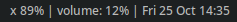
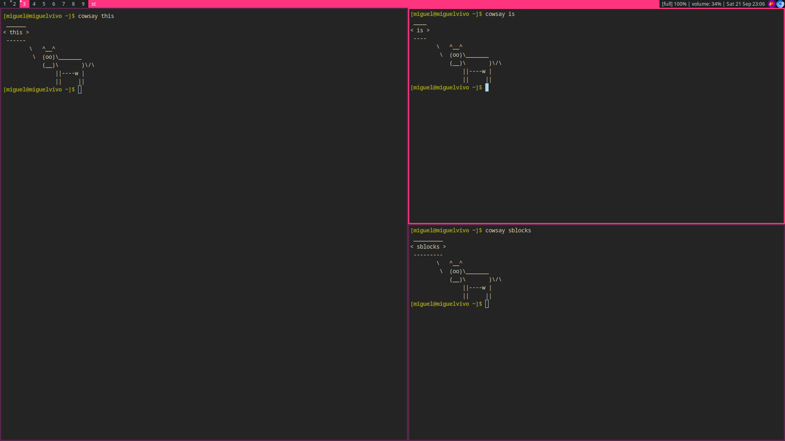

# sblocks



sblocks is a modular status bar for dwm-like X11 window managers.

## How it works

sblocks works in a very simple way: 

You specify commands (which are scripts or anything accessible in your PATH), and the output of these commands will be shown in your bar, separated by a delimeter.

## Requirements

- A C99 Compiler
- GNU Make
- libx11
- libfreetype2
- [libtoml](https://github.com/miguelnto/libtoml)

## Build

You can build this project by running `make`:

```sh
make
```

The executable will be located at the `bin` directory.

## Installation

Enter the following command to install *(as root, if needed)*:

```sh
make install
```

By default, the program is installed in `/usr/local/bin`. You can change this setting in `config.mk`.

## Usage

Put **sblocks** in your `.xinitrc` file or other startup script to have it start with your window manager. For example:

```
sblocks &
exec ndwm
```

This should execute [ndwm](https://github.com/miguelnto/ndwm) with sblocks.

## Configuration

sblocks will look for its configuration file in `~/.config/sblocks/config.toml`. If this file is not present, the program won't work. The program will not create this file for you. 

Please follow the steps below.

First of all, create the configuration file:

```
mkdir -p ~/.config/sblocks
touch ~/.config/sblocks/config.toml
```

Inside the configuration file, you'll need to declare blocks. Each block has:

- Command - Your script's name.
- Interval - The re-execution interval for your script, in seconds. If 0, don't re-execute.
- Signal - This can be any positive integer. If you want your command to be re-executed in real time, the number you put here is important. Read more about this in the [signals](#signals) section.

Now let's go through an example of what a configuration file should look like.

```toml
# Here you'll declare the delimeter for your commands.
# The delimeter can be 3 characters long at most.
# If you put more than 3 characters here, the program will read the first 3.
# This can be changed in config.h. Recompile the program to apply the changes.
delimeter = " | "

# Here we are defining an array of blocks.
# Each block contains a command, an interval and a signal.
# You can declare 20 blocks at most.
# This can be changed in config.h. Recompile the program to apply the changes.
[[block]]
command = "battery"
interval = 1
signal = 3

[[block]]
command = "vol"
interval = 0
signal = 10

[[block]]
command = "datefmt"
interval = 60
signal = 1
```

Edit the `config.toml` file according to your preference. Done.

The example above is actually the configuration I use in my system and it produces this status bar:


If you want to reproduce the same status bar you'll need to have [my scripts](https://github.com/miguelnto/scripts) installed and follow the setup in the [signals](#signals) section.


## Signals

In my laptop, I want to be able to press the volume buttons to mute, decrease, and increase the volume (**f1** to mute, **f2** to decrease and **f3** to increase). I have a script called [vol](https://github.com/miguelnto/scripts) which shows the current volume. I want the volume information to be updated in real time on my status bar. 

To acheive this, all you need to do is bind 3 keys to 3 differents commands in your hotkey daemon or window manager.

After the main command, you need to put `pkill -RTMIN+<signal> sblocks`, where the signal here is the same you defined in `config.toml`.

Below is the **[key] - [command]** list I use. I'm using the number **10** as the signal number but it can be any positive 32-bit number.

[XF86_AudioRaiseVolume] - [amixer set Master 2%+; pkill -RTMIN+10 sblocks]

[XF86_AudioMute] - [amixer sset Master toggle; pkill -RTMIN+10 sblocks]

[XF86_AudioLowerVolume] - [amixer set Master 2%-; pkill -RTMIN+10 sblocks]

## Does this work with my window manager?

If your window manager uses WM_NAME to fill the status bar, then yes.

## Screenshot

